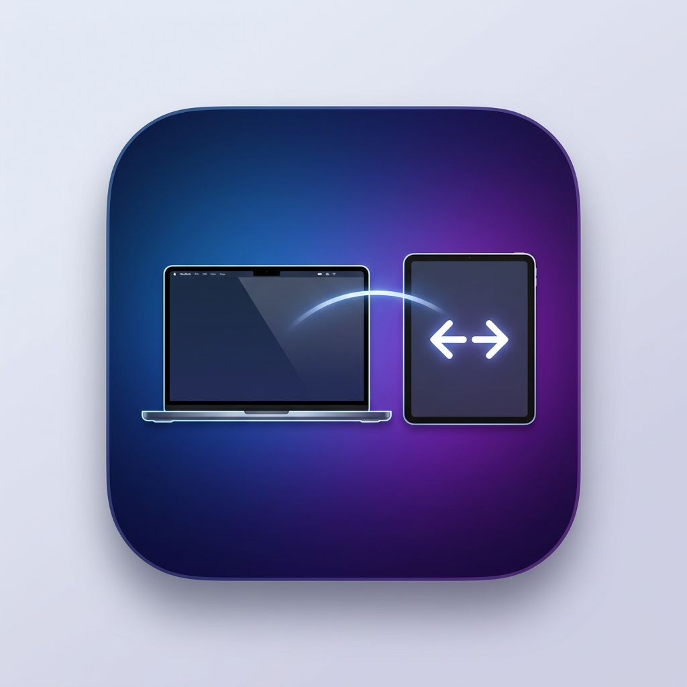
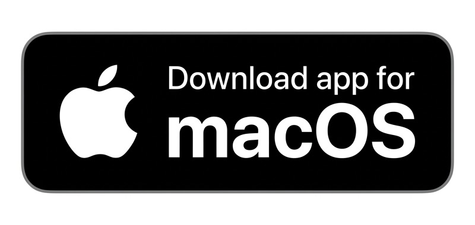

<div align="center">



# SidecarSnap

**마우스가 화면 끝에 닿으면 → iPad Sidecar가 그쪽으로 자동 배치됩니다.**
> *애플이 안 만들어서 답답해서 직접 만들었습니다.*

[](https://www.apple.com/macos/)
[](https://swift.org)
[](LICENSE)

[🇺🇸 English](README.md) | **🇰🇷 한국어** | [🇯🇵 日本語](README_ja.md)

<!-- DRAG_AND_DROP_YOUR_DEMO_VIDEO_OR_GIF_HERE -->

</div>

---

## 🇰🇷 한국어 버전

### 🤷‍♂️ 문제점

사이드카로 iPad를 보조 화면으로 쓰다가, iPad를 맥북 반대편으로 옮겼을 때마다 **시스템 환경설정 → 디스플레이 → 배열** 들어가서 아이콘 드래그... 이거 진짜 귀찮지 않았나요?

이런 불편함, 이제 그만 겪으세요.

### 💡 해결책

SidecarSnap은 마우스 커서를 추적합니다. 마우스를 화면 **왼쪽 혹은 오른쪽 끝**으로 0.5초 동안 밀어두면 Sidecar가 **자동으로 그쪽으로 배치됩니다.**

```
마우스 → 왼쪽 끝 (0.5초) = iPad가 왼쪽으로  ◀
마우스 → 오른쪽 끝 (0.5초) = iPad가 오른쪽으로 ▶
```

화면 끝에 **다이나믹 아일랜드 스타일의 검은색 물방울(Blob)**이 점점 커지면서 타이머를 시각적으로 부드럽게 보여줍니다.

### ✨ 주요 기능

| 기능 | 설명 |
|---|---|
| 🖱️ 자동 배열 | 마우스 끝 감지 → 즉각적인 Sidecar 재배치 |
| 💧 다이나믹 물방울 | 베젤에서 쫀득하게 튀어나오는 시각적 타이머 (애니메이션) |
| 🌐 다국어 지원 | English, 한국어, 日本語 — 앱 내 설명서 언어 변경 가능 |
| 👻 아이콘 숨기기 | 클릭 한 번으로 메뉴바 아이콘을 완전히 숨길 수 있음 |
| 🚀 로그인 시 시작 | Mac이 켜질 때 자동으로 실행됨 |
| ⚙️ 지연 시간 조절 | 0.3초 / 0.5초(기본값) / 1.0초 선택 가능 |

### 📥 설치 방법

**설치 방법 (가장 추천)**

<a href="https://github.com/Kimsharrrk/SidecarSnap/raw/main/SidecarSnap_v1.1.dmg">
  
</a>

1. DMG 파일을 열고, 귀여운 크레파스 배경을 감상하며 앱 아이콘을 `Applications(응용 프로그램)` 폴더로 드래그합니다!
3. 앱을 실행하고 초기 설정 가이드를 따라주세요.

> [!IMPORTANT]
> **첫 실행 시 보안 경고 해결 방법**
> 본 앱은 무료 오픈소스 프로젝트로, 유료 Apple 개발자 계정($99/년)으로 서명되지 않아 처음 실행 시 **"SidecarSnap이 손상되었기 때문에 열 수 없습니다."**라는 경고창이 뜹니다.
> 
> **실제로 앱이 손상된 것이 아니니 안심하세요!** 터미널 명령어 없이 10초 만에 바로 실행하는 방법입니다:
> 1. 경고창에서 **[취소]**를 누릅니다.
> 2. 맥의 **시스템 설정 ➔ 개인정보 보호 및 보안** 메뉴로 이동합니다.
> 3. 아래로 화면을 내려 **"보안"** 섹션을 찾습니다.
> 4. 방금 차단된 SidecarSnap 옆에 있는 **[확인 없이 열기]** 버튼을 누릅니다.
> 5. Touch ID 또는 맥 비밀번호를 입력하면 즉시 실행되며, 이후부터는 경고창 없이 정상 실행됩니다.

### ⚙️ 초기 설정 (30초 컷)

> **Step 1** — iPad를 Sidecar로 연결하세요 (제어 센터 → 화면 미러링 → iPad 선택)
>
> **Step 2** — 화면에 뜨는 팝업을 따라 손쉬운 사용(Accessibility) 권한을 허용해주세요 *(마우스 추적을 위해 필수)*
>
> **Step 3** — 끝입니다! 이제 마우스를 화면 끝으로 쓱 밀어보세요.

---

### 🙈 메뉴바 아이콘 숨기기

SidecarSnap은 상단 메뉴바에 작게 자리잡습니다.

**숨기는 방법:**
상단 메뉴바 아이콘을 클릭하고 **"Hide Menu Bar Icon(상단 아이콘 숨기기)"**를 누르세요.

> *솔직히 말하면 숨기는 거 추천드릴게요.  
> 워낙 아이콘이 못생겨서... 저도 압니다. 저희는 디자이너가 아니라 개발자니까요. 죄송합니다. 🤷*

*참고: 아이콘을 끄고 나서 나중에 설정을 변경하고 싶다면, 응용 프로그램 폴더에서 SidecarSnap 앱을 한 번 더 실행하기만 하면 아이콘이 다시 뿅 나타납니다!*

---

### 💻 시스템 요구사항

- macOS 13 (Ventura) 이상
- Sidecar를 지원하는 iPad (iPad Pro, iPad Air, iPad mini 5+, iPad 6th gen+)
- 두 기기 모두 동일한 Apple ID로 로그인되어 있어야 함

### ⚙️ 작동 원리

이 앱은 커널 확장이나 편법 없이 **오직 Apple의 공개 CoreGraphics API**만을 사용하여 안전하게 만들어졌습니다.

---

## 라이선스 (License)

Copyright © 2026 Kimsharrrk. All rights reserved.  
개인적인 용도로 무료 사용이 가능합니다. 허가 없는 소스코드의 수정 및 무단 재배포는 엄격히 금지됩니다.

---

<div align="center">

시스템 환경설정 들락날락하기 귀찮아서 직접 만든 앱입니다.

**시간을 절약하셨다면 → ⭐ 별표(Star)를 꾹 눌러주세요! 큰 힘이 됩니다.**

</div>
